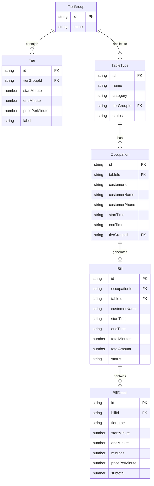

## 1. 架构设计

```mermaid
graph TB
    subgraph "前端层"
        "React SPA" --> "状态管理 Zustand"
        "React SPA" --> "路由 React Router"
    end
    subgraph "数据层"
        "Zustand Store" --> "LocalStorage 持久化"
        "Zustand Store" --> "内存计算引擎"
    end
    subgraph "核心业务模块"
        "阶梯计费引擎" --> "逐档计价计算"
        "账单生成器" --> "费用明细聚合"
        "排期管理器" --> "占用合并/拆分"
        "球台资源池" --> "状态调度"
    end
    "React SPA" --> "阶梯计费引擎"
    "React SPA" --> "账单生成器"
    "React SPA" --> "排期管理器"
    "React SPA" --> "球台资源池"
```

## 2. 技术说明

- **前端框架**：React@18 + TypeScript
- **样式方案**：Tailwind CSS@3 + CSS Variables（主题色）
- **构建工具**：Vite
- **状态管理**：Zustand（轻量、支持持久化中间件）
- **路由**：React Router@6
- **图表**：Recharts（计费可视化）
- **时间线**：自定义 Canvas/SVG 组件
- **动画**：Framer Motion
- **后端**：无后端，使用 LocalStorage 持久化模拟数据
- **数据库**：LocalStorage + 内存数据结构

## 3. 路由定义

| 路由 | 用途 |
|------|------|
| / | 大厅总览页：球台状态、快捷开台、实时计时 |
| /billing | 阶梯计费页：档位维护、计费模拟、规则说明 |
| /bills | 账单管理页：当前账单、结账、历史账单 |
| /schedule | 球台排期页：时间线、占用合并拆分、球台建档 |

## 4. API定义

无后端 API，所有逻辑在前端 Zustand Store 中实现。以下为 Store 接口定义：

```typescript
interface Tier {
  id: string;
  startMinute: number;
  endMinute: number | null;
  pricePerMinute: number;
  label: string;
}

interface TableType {
  id: string;
  name: string;
  category: 'vip' | 'open';
  tierGroupId: string;
  status: 'available' | 'occupied' | 'reserved' | 'maintenance';
}

interface Occupation {
  id: string;
  tableId: string;
  customerId: string;
  customerName: string;
  customerPhone: string;
  startTime: string;
  endTime: string | null;
  mergedFrom: string[];
  tierGroupId: string;
}

interface Bill {
  id: string;
  occupationId: string;
  tableId: string;
  customerName: string;
  startTime: string;
  endTime: string;
  totalMinutes: number;
  totalAmount: number;
  details: BillDetail[];
  status: 'active' | 'paid' | 'refunded';
  createdAt: string;
}

interface BillDetail {
  tierLabel: string;
  startMinute: number;
  endMinute: number;
  minutes: number;
  pricePerMinute: number;
  subtotal: number;
}

interface TierGroup {
  id: string;
  name: string;
  tiers: Tier[];
}
```

## 5. 服务器架构图

无后端服务

## 6. 数据模型

### 6.1 数据模型定义



### 6.2 数据定义语言

使用 LocalStorage 存储，数据结构为 JSON 序列化：

```
LocalStorage Keys:
- billiard_tier_groups: TierGroup[]
- billiard_tiers: Tier[]
- billiard_tables: TableType[]
- billiard_occupations: Occupation[]
- billiard_bills: Bill[]
```

初始数据包含：
- 默认费率组：散台费率（0-60分钟 ¥0.5/分钟，60-120分钟 ¥0.8/分钟，120分钟以上 ¥1.2/分钟）
- 包厢费率（0-60分钟 ¥1/分钟，60-120分钟 ¥1.5/分钟，120分钟以上 ¥2/分钟）
- 6张默认球台（4散台 + 2包厢）
